<p align="center">
  
</p>

<h1 align="center">baymax</h1>

<p align="center"><b>Give Claude Code a voice, ears, and a face.</b></p>

<p align="center">
  
  
  
  
</p>

<p align="center">
  <a href="#-install">Install</a> ·
  <a href="#-what-you-get">What you get</a> ·
  <a href="#-the-faces">The faces</a> ·
  <a href="#-using-it">Using it</a> ·
  <a href="#-if-something-is-wrong">Troubleshooting</a>
</p>

---

You type a question. Claude answers on screen **and says it out loud** — not the
text read back at you, a shorter spoken take, the way a colleague would tell you
across a desk. You hold a key and talk back. And a small robot floats above your
windows, lip-syncing, blinking, watching your cursor, and pulling a face at
whatever Claude is currently doing.

Everything runs on your Mac. Your speech never leaves it.

## 📥 Install

```bash
git clone https://github.com/nelsonpretti/baymax.git
cd baymax
./install.sh
```

Then, inside Claude Code, type `/baymax`. That is the whole setup.

The installer takes a few minutes — most of it downloading the two speech models
— and tells you at the end about the two macOS permissions only you can grant.
It never overwrites your Claude Code settings: hooks are appended, your existing
status line is wrapped rather than replaced, and a timestamped backup is kept.

---

## ✨ What you get

**It talks.** Claude speaks a short spoken version of every answer while you
read the detailed one. Not the text read aloud — a separate, shorter take, the
way a colleague would tell you across a desk.

**It listens.** Press `Fn+Shift` anywhere on your Mac, say what you want, press
it again. The words appear in your Claude Code terminal and send themselves. No
window switching, no dictation panel.

**It has a face.** A 250-pixel robot that follows your cursor, blinks, lip-syncs
to the voice, shows a waveform while it is listening to you, a loading bar while
Claude is reading files, a question mark when Claude needs an answer from you,
and a battery when yours is low. Click it and it winks. Click it a lot and it
gets dizzy, then annoyed.

---

## 🤖 The faces

Every one of these is drawn in code — there is not a single image file in the
robot. It picks its own expression from what Claude is doing.

| | | |
|:--:|:--:|:--:|
| 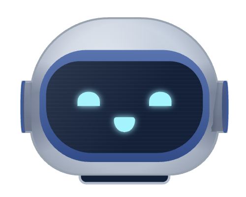<br>**Idle** — waiting for you, waving now and then | 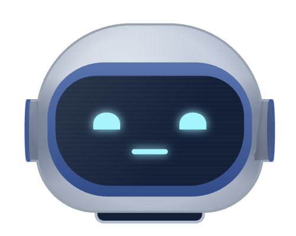<br>**Speaking** — the mouth is shaped by the actual vowels | 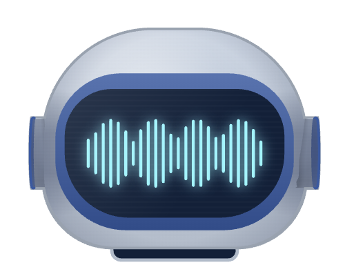<br>**Listening** — your own voice, drawn live |
| 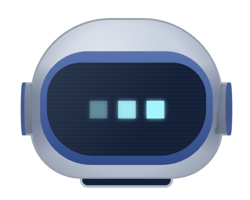<br>**Working** — reading files, running things | 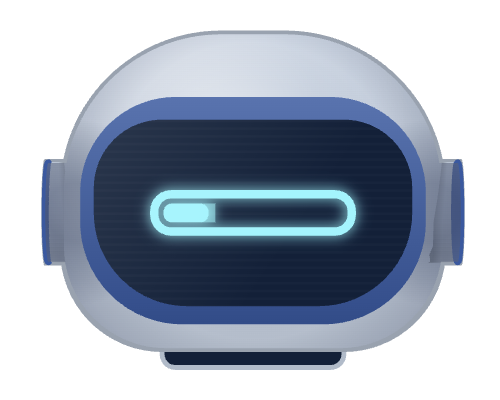<br>**Loading** — a long job in progress | 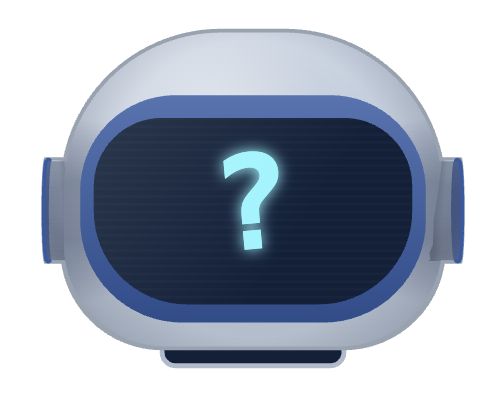<br>**Waiting** — Claude needs an answer from you |
| 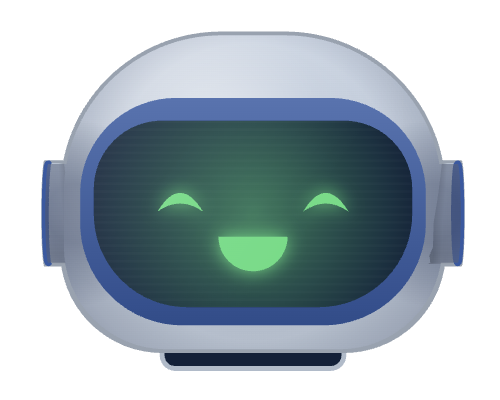<br>**Done** — it hops | 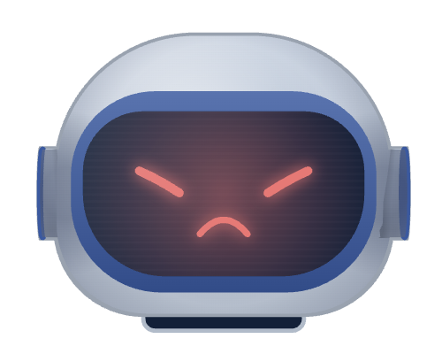<br>**Error** — something broke | 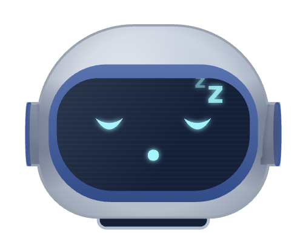<br>**Out of budget** — asleep, counting down to the refresh |
| 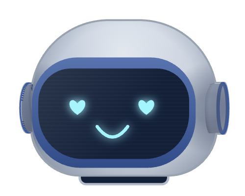<br>**Love** — you were nice to it | 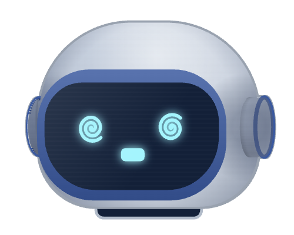<br>**Dizzy** — you clicked it too much | 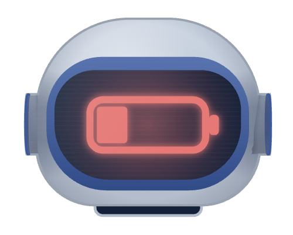<br>**Battery** — *your* Mac is low, not its |

---

## 📦 What it installs

| | Size | What for |
|---|---|---|
| Whisper `base.en` | 141 MB | Turning your speech into text |
| Kokoro-82M | 314 MB | The voice you hear |
| A Python environment | ~2 GB | PyTorch, which Kokoro needs |
| The face | ~250 MB | Electron |

All of it lands in `~/.baymax`, except the face, which stays in this
folder. The installer also copies five hook scripts and one skill into
`~/.claude` and registers the hooks in `settings.json` — appending only, with a
backup of whatever was there first.

Nothing is sent anywhere. The one exception is opt-in and described under
"Cleaning up rambling" below.

---

## 🔐 Two permissions only you can grant

macOS will not let a program read the keyboard or open the microphone without
you saying so, in **System Settings → Privacy & Security**:

- **Microphone** → your terminal app
- **Accessibility** → your terminal app

Grant them to whichever terminal you run Claude Code in. Without Accessibility
the hotkey does nothing; without Microphone you get silence transcribed.

---

## 🎛 Using it

| | |
|---|---|
| `/baymax` | Voice on. Run it again for off. |
| `Fn+Shift` | Start talking. Press again to send. |
| Click the face | It reacts. |
| Gear in the face's corner | Colours, size, the hotkey, and lip-sync timing. |

### The settings panel

Click the gear that appears when your pointer is over the face.

- **Colours** — eyes, ring, screen, body, background. **Reset colours** puts
  them all back.
- **Width / Height** — the face is a real window; drag it anywhere.
- **Voice lag** — how long after Claude starts speaking the mouth should start
  moving. Audio hardware takes a moment to wake up, and how long depends on your
  Mac. If the mouth runs ahead of the words, raise it.
- **Voice shortcut** — click it, press a new combination, done. Needs two
  modifiers, or a modifier plus a key: a lone Shift would fire every time you
  capitalise a letter.
- **Demo reactions** — plays every face it has.

---

## 🧹 Cleaning up rambling

Speech comes out messy. If you put an Anthropic API key in
`~/.claude/.voice-api-key`, anything longer than twelve words gets tidied into a
clean prompt before Claude reads it — filler removed, structure added, nothing
invented and nothing dropped. This is the only thing here that leaves your
machine, it costs a fraction of a cent per message, and without a key everything
still works, just less tidily.

---

## 🔧 If something is wrong

**The hotkey does nothing.** Accessibility permission, almost always. Check
`/tmp/voice-listener.log` — it prints `Event tap active` when it is working.

**You hear nothing.** `/tmp/voice-daemon.log`. The first run after a reboot
spends fifteen seconds loading the voice model before it says anything.

**The face is not there.** `/baymax` starts it along with the two daemons, so the
usual fix is to turn voice mode off and on again; `bin/baymax-start` does the same
thing from a terminal. It is an always-on-top window that hides from the app
switcher, so it does not appear in Mission Control.

**The mouth is out of time with the voice.** The Voice lag slider.

**Starting over:** `./uninstall.sh` then `./install.sh`.

---

## ⚙️ How the pieces fit

```
Claude finishes a turn
  └─ a Stop hook reads the echo line and sends it to voice-daemon.py
       └─ Kokoro synthesises it, afplay plays it
            └─ the face reads the same audio and moves its mouth to it

You press Fn+Shift
  └─ voice-listener.py records you and publishes your loudness
       └─ the face draws it as a waveform
  └─ you press again: whisper.cpp transcribes locally
       └─ the text is typed into your Claude Code terminal and sent
```

| | |
|---|---|
| `bin/voice-daemon.py` | Keeps the voice model in memory and speaks on request |
| `bin/voice-listener.py` | The hotkey, the recording, the transcription |
| `bin/register-hooks.py` | Merges the hooks into `settings.json` safely |
| `bin/baymax-start`, `bin/baymax-stop` | Start and stop everything |
| `face/` | The robot, drawn in code — no image files |
| `claude/hooks/` | What makes Claude speak |
| `claude/skills/voice/` | The `/baymax` command and the rules for speaking well |

---

## 📋 Requirements

macOS (it uses CoreAudio, `afplay`, and the macOS accessibility APIs),
[Homebrew](https://brew.sh), and about 3 GB free. Apple silicon or Intel.

## ⚖️ Licence

MIT.
